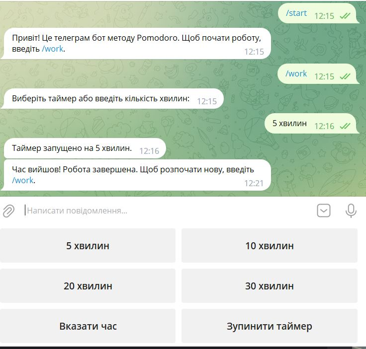

# Pomodoro method Telegram Bot
An example of developing a Telegram bot for the [Pomodoro Technique](https://en.wikipedia.org/wiki/Pomodoro_Technique)

 

 

* ✅ This bot accepts input from 1 minute to infinity.
* ✅ You can stop an already running timer.
* ✅ You can enter the number of minutes for the timer either manually or by selecting the buttons

 

 

> An example of displaying the bot's work.

